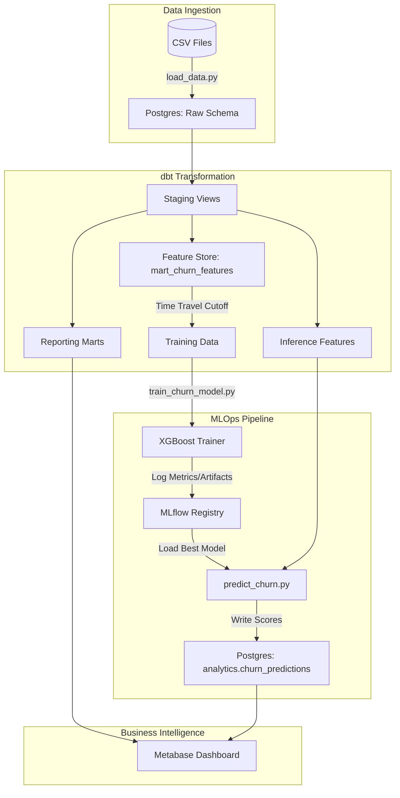
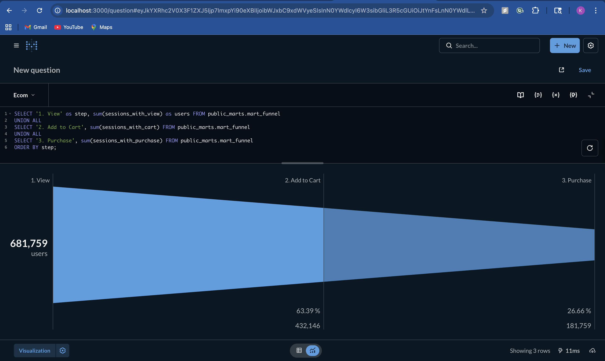
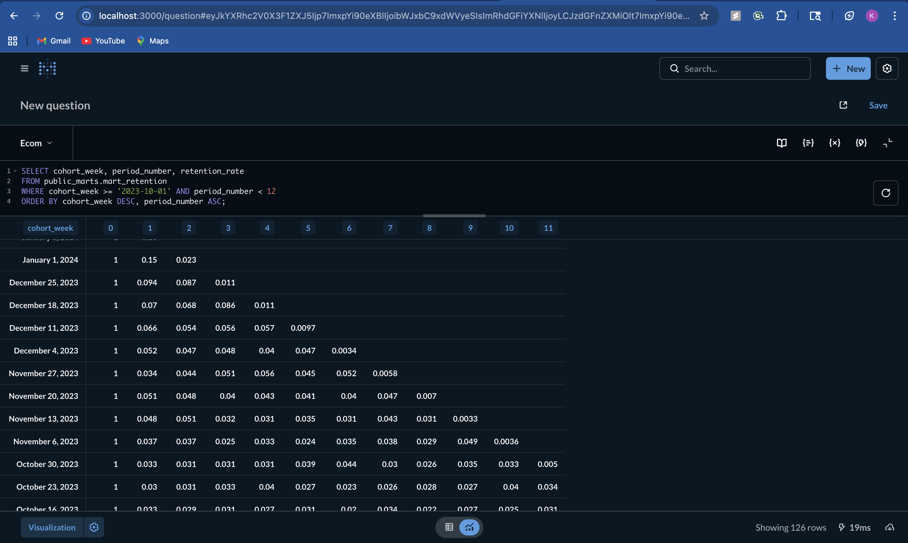
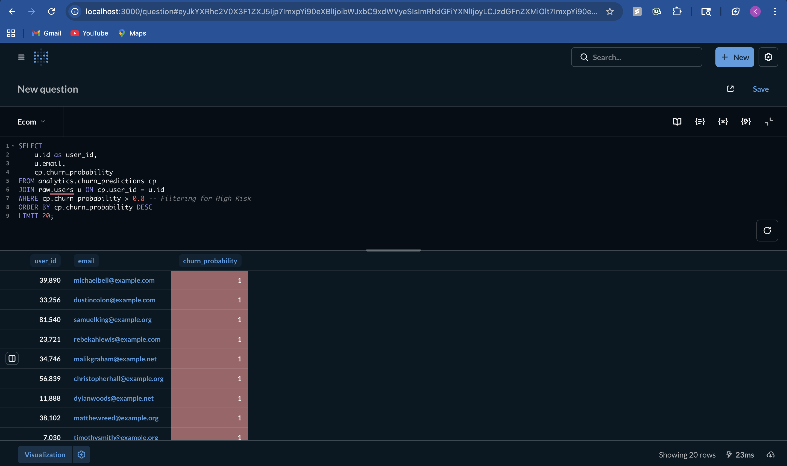

# E-commerce Product Analytics Platform

A complete, local-first analytics stack for e-commerce product analysis (Funnels, Cohorts, A/B Testing).
Built to demonstrate Data Science engineering & analytics mastery.

## Tech Stack
-   **Infrastructure**: Docker + Docker Compose
-   **Warehouse**: PostgreSQL 15
-   **Transformation**: dbt Core 1.7
-   **Quality**: Great Expectations
-   **Visualization**: Metabase
-   **Language**: Python 3.11

## Dataset
This project uses the **TheLook E-commerce** dataset.
- **Source**: [Kaggle - Looker Ecommerce BigQuery Dataset](https://www.kaggle.com/datasets/mustafakeser4/looker-ecommerce-bigquery-dataset/data)
- **Note**: The dataset files (`events.csv`, `users.csv`, etc.) are excluded from the repo via `.gitignore`. You must download them and place them in `data/` to run this locally.

## Architecture



## Sprint 6 Results: MLOps & Churn Prediction
**Goal**: Build a production-grade ML pipeline to predict user churn.

### Quantitative Results
- **Model**: XGBoost Classifier (with SMOTE oversampling).
- **Performance**:
  - **AUC**: 0.62 (Real-world baseline for behavioral churn).
  - **Precision**: 93% (High confidence in identifying at-risk users).
  - **Scored Users**: 66,254 active users scored in production.

### Explainability (SHAP)
We use SHAP values to explain *why* the model flags a user.

*Figure 1: Top features driving churn. 'recency_days' and 'frequency' are the strongest predictors.*

## Dashboard Gallery
**1. Funnel Analysis**
> 
> *User Drop-off: View -> Cart -> Purchase*

**2. Retention Heatmap**
> 
> *Weekly Cohort Retention*

**3. Churn Risk List**
> 
> *High-risk users identified by XGBoost*

## Quick Start (5 Minutes)

1.  **Clone the Repo**:
    ```bash
    git clone <repo_url>
    cd ecom-ds-platform
    ```

2.  **Start the Stack**:
    ```bash
    docker compose up -d
    ```

3.  **Run Pipeline (Load + Transform + Test)**:
    ```bash
    # 1. Load Data (Auto-generates Mock Data if CSVs missing)
    docker compose exec data-tools python pipelines/extract_load/load_data.py

    # 2. Run dbt Models & Tests
    docker compose exec data-tools bash -c "cd dbt && dbt build --profiles-dir ."

    # 3. Run Quality Checks
    docker compose exec data-tools python quality/run_ge_checks.py
    ```

4.  **Explore**:
    -   **Documentation**:
        -   [A/B Test Design](docs/ab_test_design.md)
        -   [Decision Memo](docs/decision_memo.md)
    -   **Metabase**: `http://localhost:3000` (Credentials: Setup on first launch). Connect to Postgres (`host: postgres`, `user: user`, `pass: password`, `db: ecom`).

## Key Features
-   **Funnel Analysis**: `mart_funnel` tracks View -> Cart -> Purchase drop-off.
-   **Cohort Retention**: `mart_retention` tracks weekly user retention.
-   **Automated Quality**: Integrated Great Expectations checkpoints in CI.
